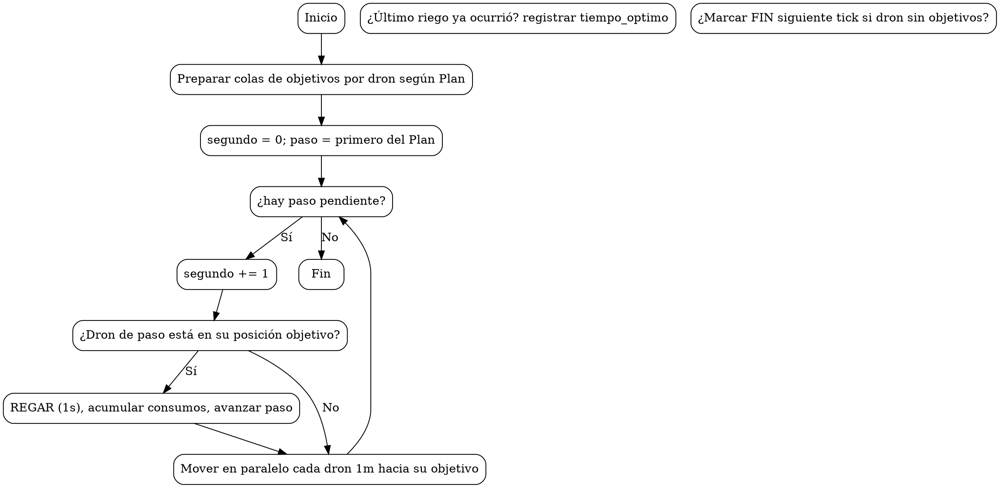

# Ensayo — Proyecto 2: GuateRiegos 2.0

**Autor:** 201503980  
**Curso:** IPC2 — 2S2025  
**Tecnologías:** Python, Flask, Graphviz

## 1. Introducción
Descripción del problema y objetivos del proyecto: optimizar el riego y aplicación de fertilizante con drones en invernaderos, respetando el orden del plan y restricciones de movimientos y tiempos.

## 2. Análisis del problema
- Un dron por hilera; movimiento 1 m/s; riego 1 s; un solo riego simultáneo por invernadero.
- Los drones pueden **moverse en paralelo** (adelante/atrás) hacia su siguiente objetivo.
- El riego se realiza estrictamente en el orden del **plan**.

## 3. Diseño de la solución
### 3.1 Paradigma y TDAs
Se usa **POO** y **TDAs propios** (ListaSimple, Cola) para modelar entidades y secuencias evitando `list`, `dict`, `tuple`, `set` en el modelado/algoritmo.

### 3.2 Diagrama de clases
Ver diagrama DOT a continuación:

```dot
digraph UML {
  rankdir=LR;
  node [shape=record];
  Sistema [label="{Sistema|+ invernaderos: ListaSimple|+ agregar_invernadero() }"];
  Invernadero [label="{Invernadero|+ nombre; + numero_hileras; + plantas_x_hilera|+ agregar_planta(); + agregar_dron(); + agregar_plan()}"];
  Hilera [label="{Hilera|+ numero|+ plantas: ListaSimple|+ buscar_planta()}"];
  Planta [label="{Planta|+ hilera; + posicion; + litros; + gramos; + nombre}"];
  Dron [label="{Dron|+ id; + nombre; + hilera; + posicion; + agua_total; + fert_total|+ objetivos: Cola}"];
  Plan [label="{Plan|+ nombre|+ pasos: ListaSimple}"];
  PasoPlan [label="{PasoPlan|+ hilera; + posicion}"];
  Simulador [label="{Simulador|+ simular(inv, plan) -> (ResultadoPlan, ListaSimple)}"];
  ResultadoPlan [label="{ResultadoPlan|+ tiempo_optimo; + agua_total; + fert_total|+ eficiencias: ListaSimple}"];
  ListaSimple [label="{ListaSimple|+ cabeza; + cola; + _len|+ agregar_final(); + buscar_primero(); + __iter__()}"];
  Cola [label="{Cola|+ _lista: ListaSimple|+ encolar(); + desencolar(); + ver_frente()}"];

  Sistema -> Invernadero [label="contiene *"];
  Invernadero -> Hilera [label="contiene *"];
  Invernadero -> Dron [label="contiene *"];
  Invernadero -> Plan [label="contiene *"];
  Hilera -> Planta [label="contiene *"];
  Plan -> PasoPlan [label="contiene *"];
  Simulador -> ResultadoPlan [label="genera"];
}
```

### 3.3 Diagrama de actividades (motor de simulación)


## 4. Implementación
- **Interfaz Flask:** carga XML, selección de invernadero/plan, simulación, reporte HTML, `salida.xml`, y graficación de TDAs en `t`.
- **XML:** `xml.etree.ElementTree` para lectura y `xml.dom.minidom` para salida.
- **Graphviz:** genera `.dot` y (si está instalado) `.png`.

## 5. Pruebas y validación
- Se incluye un XML de ejemplo que reproduce el caso del enunciado (tiempo óptimo = 8s; 5L; 500g).

## 6. Conclusiones
El motor respeta el orden del plan, permite movimiento paralelo, garantiza un solo riego por segundo y calcula métricas y reportes requeridos.

## 7. Anexos
- Código fuente documentado.
- Capturas de los reportes y grafos.
